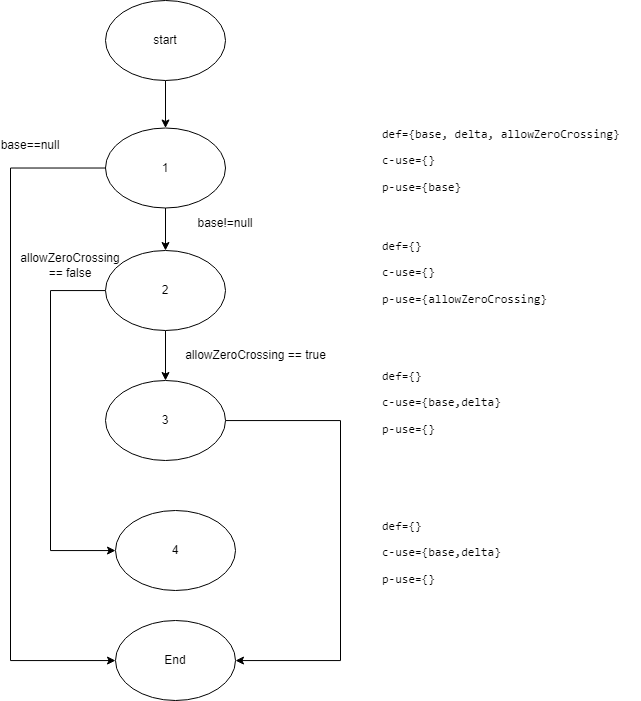
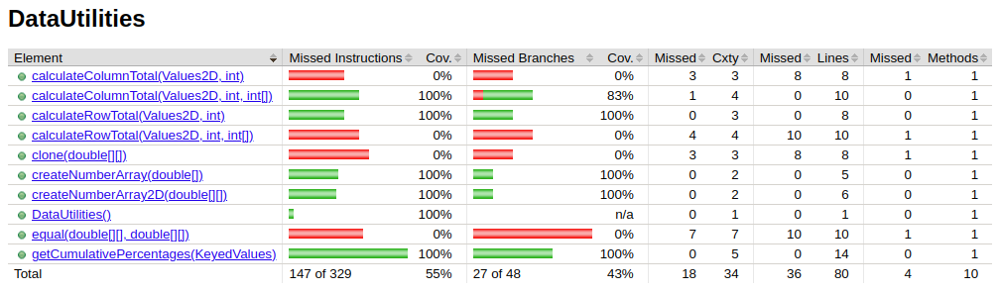

**SENG 438 - Software Testing, Reliability, and Quality**

**Lab. Report #3 – Code Coverage, Adequacy Criteria and Test Case Correlation**

| Group \#:      |     |
| -------------- | --- |
| Student Names: | Robert Brown (10180520)    |
|                | Brooke Kindleman (30090660)    |
|                | Risat Haque (30094174)    |
|                | Amnah Hussain (30095907)    |

# 1 Introduction

In this lab, white box testing was utilized to improve on the black-box tests are written in assignment 2, to evaluate the `Range` and `DataUtilities` classes from JFreeChart. Unlike the tests written for black-box testing in assignment 2, the white box tests are written for this lab is written with explicit knowledge of the source code and a focus on ensuring that as many test cases are covered as possible. To do this correctly and ensure that the white box tests written were adequate enough to cover a minimum 90% statement coverage, 70% branch coverage, and 60% condition coverage, all unit tests were evaluated using both EclEmma and JaCoCo. This ensured that multiple types of coverage were used in the assessment of the test suite’s cases. In addition to automated checking of test coverage, individual test coverage metrics were calculated manually for each method using DU-pair coverage. Tests written for this lab were intended to be simple, isolated, and existing in such a quantity that a high percentage of test coverage could be achieved through their
collective use. Written tests were reviewed between peers within the lab group to correct inconsistencies and prevent erroneous defects before metrics were evaluated. Collectively, the generated tests were able to have a wide range of coverage and adequately perform white
box testing on the `Range` and `Data Utilities` classes.

# 2 Manual Data-Flow Coverage Calculations for X and Y Methods

**Data Flow Graph:**

`calculateColumnTotal()`

.png)

`shift()`

**DU-Pairs**

`calculateColumnTotal`

For `data`  → (1,1), (1,2), (1,4)

For `column` → (1,4)

For `total` → (2,5), (2,7)

for `rowCount` → (2,3)

for `r` → (2,3), (2,6)

for `n` → (4,4), (4,5)

`shift()`

for `base` → (1,1), (1,3), (1,4)

for `delta` → (1,3), (1,4)

for `allowZeroCrossing` → (1,2)

**Pairs Covered**

`calculateColumnTotal()`

| Variable | defined at node (n) | dcu(v,n) | dpu(v,n) |
| --- | --- | --- | --- |
| data | 1 | {2,4} | {} |
| column | 1 | {4} | {} |
| total | 2 | {5,7} | {} |
| total | 4 | {5,7} | {} |
| rowCount | 2 | {} | {(3,7),(3,4)} |
| r | 2 | {6} | {(3,7),(3,4)} |
| r | 6 | {6} | {(3,7),(3,4)} |
| n | 4 | {5} | {(4,5),(4,6)} |

|  | DCU Pairs Covered | DPU Pairs Covered |
| --- | --- | --- |
| calculateColumnTotal_NonNullAndValidColumn | {2,4,5,6,7} | (3,7),(3,4),(4,5) |
| calculateColumnTotal_TooSmallColumn | {2,4,6} | (3,4),(4,6) |
| calculateColumnTotal_TooLargeColumn | {2,4,6} | (3,4),(4,6) |

`shift()`

| Variable | defined at node (n) | dcu(v,n) | dpu(v,n) |
| --- | --- | --- | --- |
| base | 1 | {3,4} | {} |
| delta | 1 | {3,4} | {} |
| allowZeroCrossing | 1 | {} | {(2,3),(2,4)} |

|  | DCU Pairs Covered | DPU Pairs Covered |
| --- | --- | --- |
| shiftValidRangeGreaterThanZero | {1,4} | {(2,4)} |
| shiftValidRangeEqualsZero | {1,4} | {(2,4)} |
| shiftValidRangeLessThanZero | {1,4} | {(2,4)} |
| shiftNullRangeLessThanZero | {1,4} | {(2,4)} |
| shiftValidRangeMinNegativeDoubleValue | {1,4} | {(2,4)} |
| shiftValidRangeMaxDoubleValue | {1,4} | {(2,4)} |
| shiftValidRangeCrossesZero | {1,4} | {(2,4)} |

**Coverage Calculation**

Calculations for DCU pairs were completed using the following formula:

$$
        CU = \Sigma_{i=1}^{n}{\Sigma_{\forall n}{|dcu(v_i, n)|}}

$$

Calculations for PCU pairs were completed using the following formula:

$$

        PU = \Sigma_{i=1}^{n}{\Sigma_{\forall n}{|{dpu(v_i, n)|}}}

$$

`caluclateColumnTotal()`

DCU Pairs = 11

DPU Pairs= 2

`shift()`

DCU Pairs = 14

DPU Pairs= 7

# 3 A Detailed Description of the Testing Strategy for the New Unit Test

## `Range(double u, double l)`

- Tested invalid input (lower bound > upper bound)

## `constrain(double v)`

- Tested above the upper boundary
- Tested with the range containing the value
- Tested below the lower boundary

## `combine(Range r, Range s)`

- Combined a null range (as the lower bound) and a valid range
- Combined a null range (as the upper bound) and a valid range
- Combined two valid ranges in the correct order

## `combineIgnoringNaN(Range r, Range s)`

- Combined a null range (as the lower bound) and a valid range
- Combined a null range (as the upper bound) and a valid range
- Combined a null range (as the lower bound) and a NaN range
- Combined a null range (as the upper bound) and a NaN range
- Combined two valid ranges in the correct order
- Combined two NaN ranges (order irrelevant)

## `expand(Range r, double lowM, double upM)`

- Expanded a range by a valid  and positive lower margin (`lowM`)  and a valid and positive upper margin (`upM`)
- Expanded a range by a valid and positive lower margin (`lowM`) and a valid and negative upper margin (`upM`)

## `shift(Range b, double d)`

- Shift a valid range to a value greater than 0
- Shift a valid range to a value of 0
- Shift a valid range to a value less than 0
- Shift a null range to a value less than 0
- Shift a valid range to the smallest negative value
- Shift a valid range to the max double value
- Shift a valid range across the value of 0
- Shift a valid range to a value less than zero with zero crossing allowed
- Shift a valid range to a value greater than zero with zero crossing allowed

## `intersects(Range b, double d, boolean allowZeroCrossing)`

- Intersects within a valid range with the boundaries not touching
- Intersects within a valid range with the boundaries touching
- Intersects a valid range above the upper boundary and below the lower boundary with no boundaries touching
- Intersects a valid range above the upper boundary and below the lower boundary with boundaries touching
- Intersects a valid range above the upper boundary and above the lower with no boundaries touching
- Intersects a valid range above the upper boundary and above the lower boundary with boundaries touching
- Intersects a valid range below the upper boundary and below the lower boundary with no boundaries touching
- Intersects a valid range below the upper boundary and below the lower boundary with boundaries touching
- Intersects the with the smallest possible range, not touching boundaries
- Tests were assessed with both an object of type Range and a pair of doubles as arguments

## `getLength()`

- Tested the length of a valid range

## `getCentralValue()`

- Tested getting the central value of a valid range

## `equals(Object obj)`

- Tested with an argument that is not an object of type Range
- Tested with an argument that is a range with the same upper bound and different lower bound
- Tested with an argument that is a range with the same lower bound and a different upper bound
- Tested with an argument that is a range with the same upper and lower bounds

## `calculateColumnTotal(Values2D data, int column)`

- Tested with null data and valid column
- Tested with valid data and valid column
- Tested with extreme data values and valid column
- Tested with very small negative values and valid column
- Tested with valid data and column above upper boundary
- Tested with valid data and column below lower boundary

## `calculateRowTotal(Values2D data, int row, int[] validCols)`

- Tested with valid data, valid row, and valid columns
- Tested with null data, valid row, and valid columns
- Tested with extreme data, valid row, and valid columns
- Tested with very small negative data, valid row, and valid columns
- Tested with valid data, valid row, and invalid columns below the lower boundary
- Tested with valid data, valid row, and invalid columns above the upper boundary
- Tested with valid data, invalid row below lower boundary, and valid columns
- Tested with valid data, invalid row above upper boundary, and valid columns

## `clone(double[][] source)`

- Tested with array containing positive values
- Tested with array containing negative values
- Tested with array set to null
- Tested with array containing nothing
- Tested with array containing extreme values
- Tested with array containing small negative values
- Tested with both arrays containing NaN values
- Tested with both arrays containing positive infinity value
- Tested with both arrays containing negative infinity value

## `createNumberArray(double[] data)`

- Tested with extreme values (previously method contained both extreme values and very small negative values)
- Tested with very small negative values (previously method contained both extreme values and very small negative values)
- Tested with NaN values
- Tested with Positive Infinity Values
- Tested with Negative Infinity Values
- Tested with null

## `createNumberArray2D(double [][] data)`

- Tested with NaN values
- Tested with Positive Infinity Values
- Tested with Negative Infinity Values

## `equal(double[][] a, double[][] b)`

- Tested with both arrays containing same positive values
- Tested with both arrays containing same negative values
- Tested with both arrays set to null
- Tested with both arrays containing the same extreme values
- Tested with both arrays containing the same small negative values
- Tested with both arrays containing nothing
- Tested with both arrays containing different values
- Tested with both arrays containing NaN values
- Tested with both arrays containing positive infinity value
- Tested with both arrays containing negative infinity value

# 4 A High Level Description of Five Selected Test Cases You Have Designed Using Coverage Information, and How They Have Increased Code Coverage

## `shift()`

The method `shift()` was tested in Lab 2, but not in to its full extent and not with the inclusion of overloaded versions other than `shift(Range r, delta d)`. The original method, for which branch coverage involves the use of multiple nodes, takes in three parameters instead of just two -- `shift(Range r, delta d, boolean allowZeroCrossing)`. Original branch coverage for this method in Lab 2 was  50% and was increased to 100% in Lab 3. This increase is due to changing the existing test cases to primarily use the original version of the `shift()` method with 3 parameters, not the overloaded version with only two, which allowed for the value of `allowZeroCrossing` to be tested explicitly, instead of implicitly set to `false`. The default setting of `allowZeroCrossing` to `false` by the overloaded version can be seen in *JfreeChart_Lab3/src/org/jfree/data/Range.java,* line 349, where the overloaded method simple calls the 3 parameter version of itself with `allowZeroCrossing` set to `false`. By ensuring that `allowZeroCrossing` was set by the test cases and not the source code, tests were able to cover a greater number of branches taken by the test, expanding to cover scenarios in which zero crossing could be allowed.  The to this was a set of test cases used to make sure that both the implicit and explicit uses of `allowZeroCrossing` in resulted in the same output from the `shift()` method when `false` was supplied as the explicit third argument in the 3 parameter version. Additionally, the input of `null` for parameter `r` was tested, to ensure the method did not allow for a null value to be shifted or treated as an object of type Range. Together, these modifications allowed the accommodation of a wider variety of possible inputs to the method was responsible for the increased test coverage.

## `getCentralValue()`

Although it is a simple method that is only intended to perform a basic mean average of the Range object’s values, `getCentralValue()` was not included in the original test suite used in Lab 2 to test Range. Because there is no decision-making done within the method, it does not increase the total branch coverage when included in the test suite. It does, however, increase the statement coverage as it was not used at all in the previous lab, and its testing in Lab 3 has allowed for it to be verified as working and covered during testing. Adding the `getCentralValue()` method to the test suite increased the statement coverage for the method from 0% in Lab 2 to 100% in Lab 3.

## `equal(double[][] a, double[][] b)`

The method `equal(double[][] a, double[][] b)` was not included in the test suite created in Lab 2, and so had an overall branch coverage and statement coverage of 0%. In Lab 3, test cases were developed to test the method, and increased method branch and statement coverage to 75% and 84%, respectively. Added test cases evaluated equivalent and valid negative and positive arrays, equivalent arrays initialized as `null`, equivalent arrays with extreme contents of `Double.MIN_VALUE`, `Double.MAX_VALUE`, `Double.POSITIVE_INFINITY`, and `Double.NEGATIVE_INFINITY`, empty equivalent arrays, equivalent arrays with `Double.NaN` content, and unequal arrays. To reach 100% branch and statement coverage, additional tests comparing `double` arrays of differing types, like a comparison of a `Double.NaN` array with a `null` array, could be utilized. For the conditions of Lab 3, however, these additional tests were not necessary and as such, were not implemented.

## `Range(double a, double b)`

A test case for the constructor of objects of type Range was not explicitly written in Lab 2 as a test case, but was added as such in Lab 3. Because the method `Range(double a, double b)` had been tested implicitly through the creation of objects of type Range used for testing the class methods, though no the constructor itself, there was already 40% statement and 50% branch coverage from Lab 2. In Lab 3’s test suite, this increased with the addition of an explicit test to verify that an object of type Range could not be constructed with invalid arguments, such as the case where `a`, representing the lower bound of the constructed range, had a greater value than `b`, which represents the upper bound. Because there are only two possible branches that can be taken in the constructor method, as seen in *JfreeChart/src/org/jfree/data/Range.java*, line 90, based on the comparison of the values of arguments `a` and `b`, the addition of a test case verifying correct method behaviour in response to incorrect inputs provided the final 50% branch coverage necessary for the method to have 100% branch coverage. This test case also included `Range(double a, double b)` as an independently tested method, vastly increasing the amount of statement coverage it was provided, and allowing for 100% statement coverage to be achieved in Lab 3’s test suite.

## `clone(double [][] s)`

The method `clone(double [][]s)` was not included in Lab 2’s test suite, and as such, had a branch and statement coverage of 0%. In Lab 3, test cases were developed to test the method using inputs that included valid arrays, empty arrays, arrays containing extreme values such as `Double.MAX_VALUE` and `Double.MIN_VALUE`, as well as `null` and `Double.NaN` values. By testing these values, it was possible to increase the statement coverage to 100% in Lab 3, as the method `clone(double[][] s)` has a limited number of situations it is applicable in. Branch coverage was able to be increased to 75%, using the developed test cases. The uncovered 25% likely belongs to statements testing more rigorous invalid inputs such as non-double arrays and arrays that were not null themselves, but contained null values.

# 5 A Detailed Report of the Coverage Achieved Of Each Class and Method (A Screen Shot From the Code Cover Results in Green and Red Color Would Suffice)

*Fig 5.1 - DataUtilities test coverage from Lab 2’s test suite*

*Fig 5.2 - DataUtilities test coverage from Lab 3’s test suite*

*Fig 5.3 - Range test coverage from Lab 2’s test suite*

*Fig 5.4 - Range test coverage from Lab 2’s test suite*

# 6 Pros and Cons Of Coverage Tools Used and Metrics You Report

The primary coverage too used in our report was the implementation of EclEmma built into Eclipse - JaCoCo. This coverage tool is useful because it integrates directly with the Eclipse IDE and provides specific information about branching and where additional testing can be implemented. A downside to JaCoCo is the lack of condition coverage as well as making it difficult to compare specific results from different versions of the code. Additionally, with JaCoCo, when testing with `@Test{expected=...` no coverage is shown, therefore not giving the most accurate results since a number of the tests written used the `@Test{expected=...` feature.

We also utilized statement coverage, branch coverage, and method coverage for our report. We chose to utilize method coverage in our case instead of condition coverage since it was one of the provided metrics in JaCoCo. The statement and branch coverages provided good insight into behaviours in which we had previously missed testing. The statement indicated some statements were never covered in cases where it was difficult to reach a specific instruction. With the method coverage metric it just reported the quantity of testing (i.e. if a method was covered or not) instead of describing if a method was completely tested or not. Branch coverage provided the best of both worlds by indicating which methods were covered and how thoroughly they were covered for each specific case.

# 7 A Comparison an the Advantages and Disadvantages of Requirements-Based Test Generation and Coverage-Based Test Generation

Where requirements-based testing utilizes a test development method based only on the executable portion of a program, not the original source code, coverage-based testing provides a mathematical approach to determine the test coverage of the source code itself, where the tester has the ability to reference it when creating a test suite. This allows for a more cohesive test suite to be constructed and creates a product that prepares for failure for cases beyond a user's ability to understand or locate within the program itself. Coverage-based testing can find bugs and failures in the code that requirements-based testing can’t, since, coverage-based testing checks for failure line-by-line in the program instead of holistically and only using the interface accessible to the user. Alternatively, requirements-based testing is more efficient and practical for larger applications. For applications with multiple files, thousands of lines of code and programs ranging across platforms, coverage base testing can be a challenge to complete due to the lack of resources. It can also be unnecessary to test features that are guaranteed to not fail, for example, overloaded methods that are referenced by methods that are rigorously tested (`shift`). This redundancy is a disadvantage for coverage-based testing, and can prove to be both tedious and inefficient when there is a large amount of code to be tested. 

# 8 A Discussion on How the Team Work/Effort Was Divided And Managed

Each section of the lab was completed differently. Section 2 and 3.1 were done collaboratively to ensure consistency in our testing & coverage frameworks. Section 3.2 and 3.3 were divided evenly among the 4 of us. Brooke and Robert were responsible for their respective method in the Range class, alongside the manual calculation. Amnah and Risat were responsible for the DataUtilities class and the manual calculations. Each team was divided further where one individual conducted the test and the other treated the dataflow graph, def-use sets and DU-pairs. After this, we verified each other solutions and collaborated to make final touches to our test suite. 

In preparation for our demo, we further checked each other's work and worked through the deliverables of the assignment to ensure completion. Finally, the report was divided evenly among the 4 of us based on the tasks we were initially assigned. 

# 9 Any Difficulties Encountered, Challenges Overcome, and Lessons Learned from Performing The Lab

Initially, we had inconsistent results in our coverage tests among our devices. The lack of consistency can be attributed to the different testing tools, which we overcame by switching tools and debugging our tests in depth. We solved this issue through collaboration which inevitably prevented larger issues in our new tests.

Overall, we developed important skills in testing and understanding how to increase coverage through analysis and manual calculations. The flow graphs provided a framework for the testing which is a tool that can be helpful in the future. 

# 10 Comments/Feedback on the Lab Itself

Overall a good lab, really interesting to see the progression of test cases from the last lab.